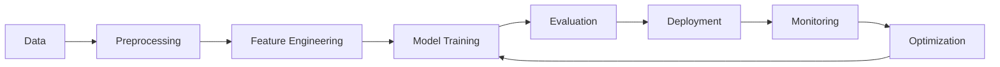

<div align="center">

<!-- AI/ML Themed Banner -->


<!-- Typing Animation -->
<a href="https://git.io/typing-svg"></a>

<br/>

[](https://github.com/courageous0102)
[](https://github.com/courageous0102)

</div>

---

## 🧠 About Me - Neural Network Profile

```python
import tensorflow as tf
import numpy as np
from datetime import datetime

class AIEngineer:
    def __init__(self):
        # Personal Metadata
        self.name = "Abhishek Prasad"
        self.username = "courageous0102"
        self.role = "AI/ML Engineer & Data Scientist"
        self.status = "B.Tech CSE - 3rd Year"
        self.experience_years = 2
        self.email = "abhip9835@gmail.com"
        
        # Neural Network Architecture
        self.skills = {
            'programming': ['Python', 'Java', 'C', 'C++'],
            'ml_frameworks': ['TensorFlow', 'PyTorch', 'Keras', 'Scikit-learn'],
            'ai_domains': ['Deep Learning', 'NLP', 'Computer Vision', 'LLMs'],
            'data_science': ['Pandas', 'NumPy', 'Matplotlib', 'Plotly'],
            'cloud': ['AWS', 'GCP'],
            'specialization': ['RAG', 'Transformers', 'Model Optimization']
        }
        
        # Current Training Loop
        self.learning_pipeline = [
            "🎯 Advanced Machine Learning Algorithms",
            "🧬 Deep Neural Networks & Architectures",
            "💬 Large Language Models (LLMs)",
            "🔗 Retrieval-Augmented Generation (RAG)",
            "☁️ Cloud ML Deployment (AWS SageMaker)",
            "🚀 MLOps & Model Production",
        ]
        
        # Model Performance Metrics
        self.achievements = {
            'accuracy': 'High',
            'passion': 'Maximum',
            'collaboration': 'Always Open',
            'innovation': 'Continuous'
        }
    
    def forward_pass(self):
        """Processing current projects and learning"""
        projects = [
            "Building production-ready ML models",
            "Implementing LLMs in real-world applications",
            "Creating RAG systems for intelligent retrieval",
            "Developing AI-powered solutions"
        ]
        return projects
    
    def backward_propagation(self):
        """Learning from feedback and improving"""
        return "Always optimizing through collaboration and feedback!"
    
    def predict_future(self):
        """My vision for the future"""
        return "Creating AI systems that make a real impact 🚀"
    
    def connect(self):
        """Let's collaborate!"""
        return f"📧 Reach me at: {self.email}"

# Initialize the model
abhishek = AIEngineer()
print(abhishek.predict_future())
print(abhishek.connect())
```

<div align="center">
  
### 💡 *"Turning data into intelligence, one model at a time"*

</div>

---

## 🌐 Connect & Collaborate

<div align="center">

[](https://linkedin.com/in/Abhishek%20Prasad)
[](https://instagram.com/mantastic._07)
[](mailto:abhip9835@gmail.com)
[](#)

</div>

---

## 🎯 Current Learning Pipeline

<div align="center">



</div>

<table align="center">
<tr>
<td align="center" width="25%">

<br/><br/>
<b>Machine Learning</b>
<br/><br/>
<sub>Supervised & Unsupervised Learning<br/>Model Optimization<br/>Feature Engineering</sub>
</td>

<td align="center" width="25%">

<br/><br/>
<b>Deep Learning</b>
<br/><br/>
<sub>Neural Networks<br/>CNNs & RNNs<br/>Transfer Learning</sub>
</td>

<td align="center" width="25%">

<br/><br/>
<b>LLMs & NLP</b>
<br/><br/>
<sub>GPT Models<br/>RAG Systems<br/>Fine-tuning</sub>
</td>

<td align="center" width="25%">

<br/><br/>
<b>Cloud & MLOps</b>
<br/><br/>
<sub>AWS SageMaker<br/>Model Deployment<br/>CI/CD Pipelines</sub>
</td>
</tr>
</table>

---

## 💻 Tech Stack - AI/ML Arsenal

### 🤖 AI/ML & Data Science
<p align="center">


</p>

### 👨‍💻 Programming Languages
<p align="center">


</p>

### ☁️ Cloud & Deployment
<p align="center">


</p>

### 🛠️ Tools & Platforms
<p align="center">


</p>

### 🗄️ Databases
<p align="center">


</p>

---

## 📊 GitHub Analytics - Model Performance Metrics

<div align="center">

<!-- GitHub Stats -->


<!-- GitHub Streak -->


</div>

<div align="center">

<!-- Most Used Languages -->


<!-- GitHub Activity Graph -->


</div>

---

## 🏆 GitHub Trophies & Achievements

<div align="center">


</div>

---

## 📈 Contribution Graph

<div align="center">


</div>

---

## 🎨 3D Contribution Calendar

<div align="center">


</div>

---

## 💭 AI-Generated Dev Quote

<div align="center">


</div>

---

## 🔥 Current Projects & Focus Areas

<div align="center">

```python
current_projects = {
    "🤖 Machine Learning Models": {
        "status": "In Production",
        "description": "Building scalable ML models for real-world problems",
        "tech_stack": ["TensorFlow", "PyTorch", "Scikit-learn"]
    },
    "💬 LLM Applications": {
        "status": "Active Development",
        "description": "Implementing Large Language Models in applications",
        "tech_stack": ["Transformers", "Hugging Face", "OpenAI API"]
    },
    "🔗 RAG Systems": {
        "status": "Research & Development",
        "description": "Creating intelligent retrieval systems",
        "tech_stack": ["LangChain", "Vector DBs", "Embeddings"]
    },
    "☁️ AI on Cloud": {
        "status": "Learning & Deploying",
        "description": "Deploying ML models on cloud platforms",
        "tech_stack": ["AWS", "SageMaker", "Lambda"]
    }
}

for project, details in current_projects.items():
    print(f"{project}: {details['status']}")
```

</div>

---

## 🎓 Learning Roadmap 2024-2025

<div align="center">

| Quarter | Focus Area | Technologies | Status |
|---------|-----------|--------------|--------|
| Q1 2024 | **Deep Learning Fundamentals** | TensorFlow, PyTorch, Keras | ✅ Completed |
| Q2 2024 | **Natural Language Processing** | NLTK, spaCy, Transformers | 🔄 In Progress |
| Q3 2024 | **Large Language Models** | GPT, BERT, LLaMA, RAG | 🔄 In Progress |
| Q4 2024 | **Computer Vision** | OpenCV, YOLO, CNN | 📅 Planned |
| Q1 2025 | **MLOps & Production** | Docker, Kubernetes, MLflow | 📅 Planned |
| Q2 2025 | **Advanced AI Systems** | Multi-modal AI, AGI Research | 🎯 Future Goal |

</div>

---

## 🌟 Featured AI/ML Projects

<div align="center">

[](https://github.com/courageous0102)
[](https://github.com/courageous0102)

</div>

---

## 🎯 Skills & Expertise Radar

<div align="center">

```text
         Machine Learning ████████████████░░ 85%
            Deep Learning ███████████████░░░ 80%
                 LLMs/RAG ██████████████░░░░ 75%
                   Python █████████████████░ 90%
             Data Science ████████████████░░ 85%
    Cloud (AWS/GCP)      ████████████░░░░░░ 65%
           Computer Vision ███████████░░░░░░ 60%
                      NLP ██████████████░░░░ 75%
```

</div>

---

## 📚 AI/ML Resources I Recommend

<details>
<summary><b>📖 Click to expand my favorite learning resources</b></summary>

### 📺 YouTube Channels
- 🎥 **3Blue1Brown** - Neural Networks Visualized
- 🎥 **Andrej Karpathy** - Deep Learning & AI
- 🎥 **Two Minute Papers** - Latest AI Research

### 📚 Books
- 📖 **Deep Learning** by Ian Goodfellow
- 📖 **Hands-On Machine Learning** by Aurélien Géron
- 📖 **Pattern Recognition and Machine Learning** by Christopher Bishop

### 🌐 Online Courses
- 🎓 **Fast.ai** - Practical Deep Learning
- 🎓 **DeepLearning.AI** - Andrew Ng's Courses
- 🎓 **Hugging Face Course** - NLP & Transformers

### 📰 Research Papers & Blogs
- 📄 ArXiv.org - Latest Research Papers
- 📄 Towards Data Science - ML/AI Articles
- 📄 Distill.pub - Interactive ML Concepts

</details>

---

## 🤝 Let's Collaborate!

<div align="center">

### I'm always interested in:

🔬 **Research Projects** | 🚀 **Startup Ideas** | 💡 **Open Source** | 🎓 **Learning Together**

<br/>

**Want to build something amazing with AI?**

[](mailto:abhip9835@gmail.com)

</div>

---

## 🎨 Fun Facts About Me

<div align="center">

```python
fun_facts = {
    "🧠 First Program": "Hello World in Python (fell in love instantly!)",
    "☕ Fuel": "Coffee + Classical Music = Peak Productivity",
    "🎯 Motto": "Make AI accessible, ethical, and impactful",
    "🌙 Night Owl": "Best code written between 10 PM - 2 AM",
    "🎮 Debugging Style": "Print statements everywhere (then use debugger)",
    "📊 Favorite Dataset": "MNIST (the hello world of ML)",
    "🤖 Dream Project": "Contributing to AGI development"
}

for key, value in fun_facts.items():
    print(f"{key}: {value}")
```

</div>

---

<div align="center">

### 💡 *"In the age of AI, the only limit is imagination"*

<br/>


**Thanks for visiting! Let's build the future with AI 🚀**

<br/>

[](https://visitcount.itsvg.in)

*Last Updated: 2024 | Made with ❤️ and Python*

</div>
